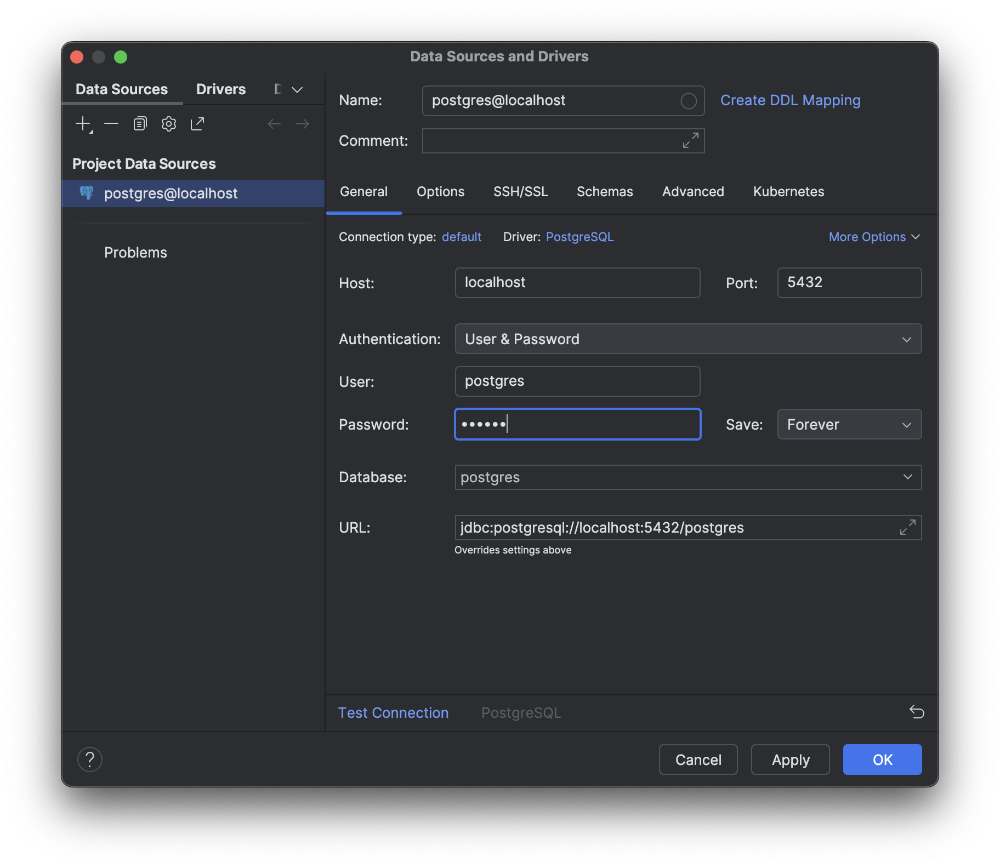
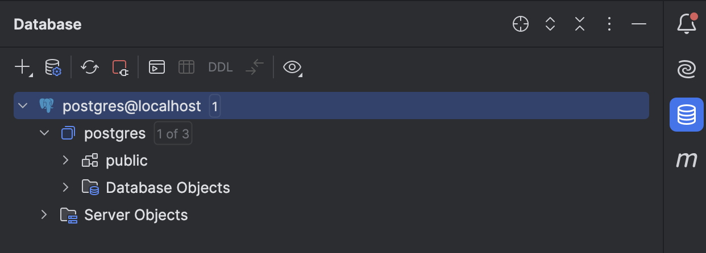
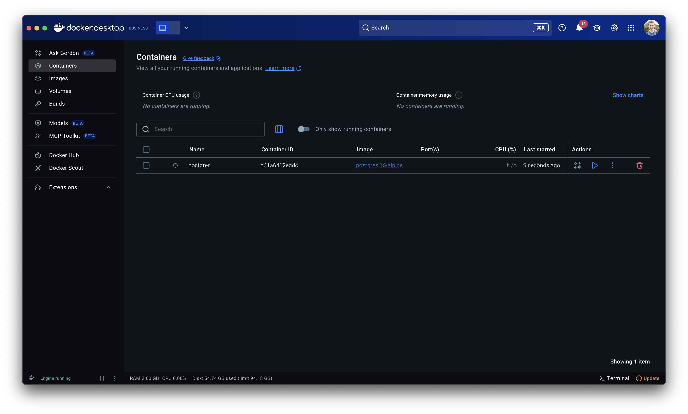

# Hands-on One: Running containers

## Learning objectives

In this hands-on, you will complete the following objectives:

- Start a database container
- Use tools to troubleshoot and debug containers
- Learn how to use environment variables and file mounting to configure containers

Let's get started!


## Segment One: Starting a container

In this segment, we're going to start a PostgreSQL database in a container. Let's learn how! 

1. Use the `docker run` command in a terminal to start a PostgreSQL container:

    ```bash
    docker run -d --name=postgres postgres:16-alpine
    ```

   This command is using the following flags:

    - `-d` - run the container in "detached" mode. This runs the container in the background
    - `--name postgres` - give this container a specific name. Normally, this flag is skipped and an auto-generated name is used. But, it helps in workshops.
    - `postgres:16-alpine` - this is the name of the container image to run

    The output that you see is the full container ID.

2. To view the running containers, you use the `docker ps` command:

    ```console
    docker ps
    ```

    After running the previous command, you should see output similar to the following:

    ```plaintext
    CONTAINER ID   IMAGE     COMMAND   CREATED   STATUS    PORTS     NAMES
    ```

    Where is the container we just ran? Maybe it didn't start successfully?

3. View all containers, even those that are no longer running, by adding the `-a` flag to the command:

    ```console
    docker ps -a
    ```
   
    With that, you should now see output similar to the following:

    ```plaintext
    CONTAINER ID   IMAGE                COMMAND                  CREATED         STATUS                     PORTS     NAMES
    f8c7b5660668   postgres:16-alpine   "docker-entrypoint.s…"   2 seconds ago   Exited (1) 2 seconds ago             postgres
    ```

    There it is! As we thought, the container did fail to start (per the `STATUS` column). Let's see if we can figure out what's going on.

4. View the logs of the container by using the `docker logs` command:

    ```console
    docker logs postgres
    ```
   
    The `docker logs` command requires either the name of a container or the ID. Since we previously named the container `postgres`, we were able to reference it with that name here.

    In the log output, you should see something similar to the following:

    ```plaintext
   Error: Database is uninitialized and superuser password is not specified.
       You must specify POSTGRES_PASSWORD to a non-empty value for the
       superuser. For example, "-e POSTGRES_PASSWORD=password" on "docker run".

       You may also use "POSTGRES_HOST_AUTH_METHOD=trust" to allow all
       connections without a password. This is *not* recommended.

       See PostgreSQL documentation about "trust":
       https://www.postgresql.org/docs/current/auth-trust.html
    ```

    This error message is telling us that the container requires the definition of an environment variable named `POSTGRES_PASSWORD`.

5. Since we can't modify the environment variables for an existing container, we will have to create a new one. Use the following command to create a new container, but this time with the required variable:

    ```console
    docker run -d --name=postgres -e POSTGRES_PASSWORD=secret postgres:16-alpine
    ```
   
    When you run this command, you will get an error that looks similar to the following:

    ```plaintext
    docker: Error response from daemon: Conflict. The container name "/postgres" is already in use by container "f8c7b5660668324140f773b0a54a723bfe069a4d71ba231ca2ec8c4f33ddd314". You have to remove (or rename) that container to be able to reuse that name.
    ```

    We got this because we tried to use the same name as the previous container and names must be unique. This is why we generally don't specify names for our containers.

6. Remove the previous container using the `docker rm` command:

    ```console
    docker rm postgres
    ```
   
7. Run the previous command again to start our database container:

    ```console
    docker run -d --name=postgres -e POSTGRES_PASSWORD=secret postgres:16-alpine
    ```
   
    This time, it should stay up and running! Hooray!


## Segment Two: Connecting to the database

If we try to connect the database using an IDE plugin or via the CLI, we'll find that we can't connect to it. Let's fix that!

1. Create a data source in IntelliJ using [these instructions](https://www.jetbrains.com/help/idea/postgresql.html):

    - **Host**: localhost
    - **Username**: `postgres` (the default username the container uses)
    - **Password**: `secret` (the password we specified in the environment variable)
  
    

2. Try to connect to the data source. You should see that it fails.
    
    It is failing to connect because the container is running in an isolated environment. This means all ports it uses are, by default, inaccessible from the host. Other containers can talk to it, but an extra step is required to access it from the host.

3. Remove the current container:

    ```console
    docker rm postgres
    ```
   
4. Let's use the `-p` flag to "publish" a port, which will connect port 5432 of the host machine to port 5432 of the database container:

    ```console
    docker run -d -p 5432:5432 --name=postgres -e POSTGRES_PASSWORD=secret postgres:16-alpine
    ```

5. Now, try to connect your IDE to the database. It should now connect!

    


## Segment Three: Auto-seeding the database

The PostgreSQL image from Docker Hub provides the ability to automatically load schemas and data at startup, using any files found in the `/docker-entrypoint-initdb.d` directory.

In the `db` folder is a file named `schema.sql`. By using a [bind mount](https://docs.docker.com/engine/storage/bind-mounts/), we can share this file with a container.

1. Remove the postgres container, if it's still running:

    ```console
    docker rm -f postgres
    ```

2. Start a new container and share the `db` folder with the container with the additional `-v` flag:

    ```console
    docker run -d -v ./db:/docker-entrypoint-initdb.d -p 5432:5432 --name=postgres -e POSTGRES_PASSWORD=secret postgres:16-alpine
    ```

3. If you want to check the schema, you can run the following command:

    ```console
    docker exec -ti postgres psql -U postgres -c "\dt"
    ```

    With that, you should see a table through output similar to the following:

    ```plaintext
            List of relations
    Schema | Name  | Type  |  Owner   
    --------+-------+-------+----------
    public | todos | table | postgres
    (1 row)
    ```

4. When you're done, go ahead and remove the container:

    ```console
    docker rm -f postgres
    ```
    

## Extra - using the Docker Desktop Dashboard

Everything we just did can also be completed using the Docker Desktop dashboard.

### Viewing the failed container

By default, the table view in the dashboard shows all containers, even those that are stopped.



### Viewing container logs

Clicking on any container in the row will open the container logs


## Recap

In this hands-on, you accomplished the following:

- Started a PostgreSQL container
- Learned how to use container logs to troubleshoot issues
- Learned how to connect to it using built-in IDE tooling
